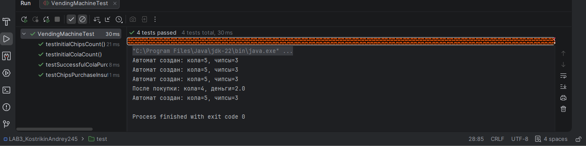

## 👨‍🎓 Студент
- **ФИО:** Кострикин Андрей Игоревич
- **Группа:** ИС-245
- **Вариант:** 12 (Торговый автомат)

---

## ✅ Выполненные задания

### Задание 1 (Простое)
**Тест:** Используйте @BeforeEach для создания автомата с 5 колами и 3 чипсами. Проверьте начальные количества.

### Задание 2 (Среднее)
**Тесты:**Проверьте покупки. Напишите два теста с использованием @BeforeEach:

Успешная покупка колы за 2.0 (кол становится 4, деньги собраны 2.0).
Покупка чипсов при недостатке денег (1.0) — покупка не происходит.

---

## 📊 Результаты

---

## 📎 Ссылки
- [Код тестов](LAB3_KostrikinAndrey245/src/test/VendingMachineTest.java)
- [Основной класс](LAB3_KostrikinAndrey245/src/VendingMachine.java)

*Дата: 11.03.2026*
